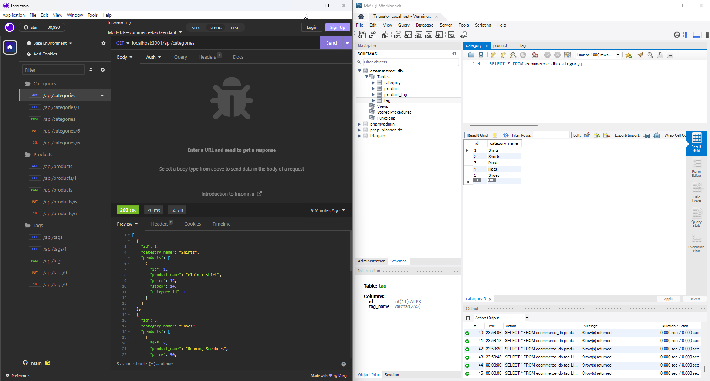

# Mod-13-e-commerce-back-end

## Description

A node.js backend application that provides CRUD database usage for products, categories, and tags.

## Installation

Project has a dependencies the user must run npm install to include the needed libraries.  Additionally, node.js must be installed.

## Usage

Run npm start from the installed folder. 

Sample usage video link: [Here](https://youtu.be/KCZsr6dCVRo)

The following image shows the application's appearance and functionality in insomnia:

## Credits

N/A

## License

N/A
